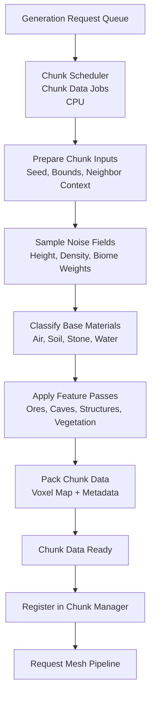

# Chunk & World Generation (Overview)

# Version 1.0 (Chunk Jobs)

## Generation Pipeline

### Description

In version 1.0, world generation is fully chunk-based and CPU job driven.
The scheduler collects generation requests, batches chunk jobs, and builds voxel data for each chunk.
Inside the generate step, each chunk job runs a fixed sequence: prepare inputs, sample noise fields, classify base
materials, run feature passes (ores/caves/structures/vegetation), apply border fixups, then pack the final voxel map and
metadata.
When chunk data is finished, it is registered in the chunk manager and forwarded to the mesh pipeline for visual and
collider updates.

Advantages:

- Simple and deterministic pipeline with clear stage boundaries.
- Easy to debug because generation and handoff happen in explicit queue steps.
- Works well for small and medium visible worlds.

Trade-offs:

- Regeneration cost can spike when many chunks are dirty in the same frame.
- CPU-side generation becomes a bottleneck as world size and update frequency grow.
- Local edits can trigger broader recomputation depending on chunk dependencies.
