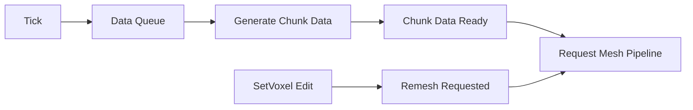

# Chunk Pipeline (Overview)

```mermaid
flowchart LR
    A[Tick] --> B[Data Queue]
    B --> C[Generate Chunk Data]
    C --> D[Chunk Data Ready]
    D --> E[Request Mesh Pipeline]

    X[SetVoxel Edit] --> Y[Remesh Requested]
    Y --> E
```

