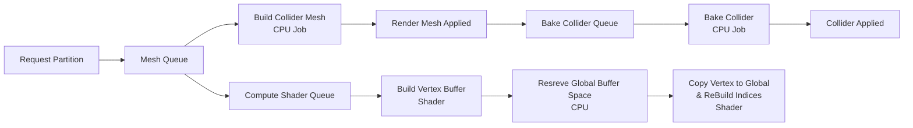

# Mesh & Render Pipeline (Overview)

# Version 1.0 (Chunks)
## Mesh Pipeline


### Description

In version 1.0, the mesh pipeline is built around the concept of "chunks".
Each chunk represents a portion of the world and is responsible for generating its own render and collider meshes.
The process starts with a request for a chunk, which triggers the mesh queue to build both the render and collider
meshes using CPU jobs.
Once the render mesh is applied, the collider mesh is baked in a separate queue before being applied to the chunk.

The main advantage of this approach is its simplicity and low Draw Calls, as each chunk can be rendered with a single
mesh.
However it leaded to performance issues as the hole Chunk mesh needs to be rebuilt even if only a small portion of it is
changed. This resulted in slow updates and a less responsive experience for players.

## Render Pipeline (Texture Array)

```mermaid
flowchart LR
    
```
### Description


# Version 1.1 (Partitions)


### Description

In version 1.1, the mesh pipeline was updated to use "partitions" instead of chunks.
Partitions are smaller sections of a chunk that can be updated independently, allowing for more efficient mesh
generation.
The process is similar to version 1.0, but instead of building a mesh for an entire chunk, the mesh queue builds meshes
for individual partitions.

The main advantage of this approach is improved performance and responsiveness of the Mesh Pipeline, as only the
affected partitions need tobe rebuilt when changes occur.
However, it leads to increased Draw Calls, as each partition requires its own mesh (or SubMesh),
which impacts rendering performance if there are many partitions in view.
For example, if a chunk is divided into 16 partitions and we have 3 materials per Mesh,
even with culling we get 6000+ Draw Calls very quickly, which caused significant performance degradation.

## Render Pipeline (Vertex Pulling with Geom)

```mermaid
flowchart LR
    
```
### Description

# Version 1.2 (Compute Shaders)



### Description

In version 1.2, the mesh pipeline was further optimized by introducing compute shaders for mesh generation.
The process starts similarly to version 1.1, with a request for a partition triggering the mesh queue to build the
collider mesh using CPU jobs.
However, instead of building the render mesh on the CPU, a compute shader is used to build the vertex buffer for the
render mesh.
This allows for much faster mesh generation, as the GPU can handle the parallel processing of vertices more efficiently
than the CPU.
After the vertex buffer is built, a global buffer space is reserved on the CPU, and the vertex data is copied to the
global buffer while the indices are rebuilt using another shader.

This approach significantly reduces the time required to update meshes and improves
the overall performance of the mesh pipeline. However, it also introduces additional complexity in terms of shader
programming and buffer management.

The main improvement in this version is the significant reduction in mesh generation time and Draw Calls, as the Global
Buffers allow for more efficient rendering of multiple partitions with fewer Draw Calls, even when many partitions are in view.
So now we can easily render 16x16x16 partitions of 32x32x32 Voxels with 3 materials each and draw millions of vertices.

## Render Pipeline (Mesh less Draw, Global Buffers, Index Vertex Pulling)

```mermaid
flowchart LR
    
```
### Description