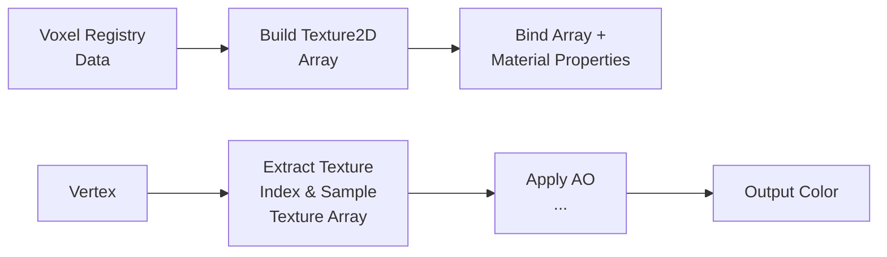
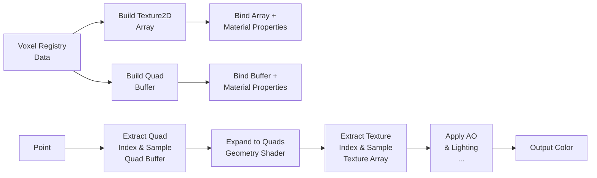
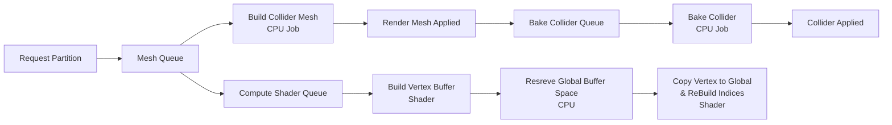
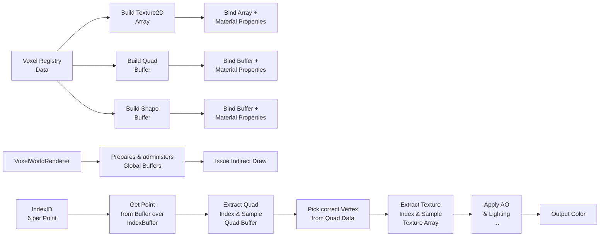

# Mesh & Render Pipeline (Overview)

# Version 1.0 (Chunks)

## Mesh Pipeline

### Description

In version 1.0, the mesh pipeline is built around whole chunks.
Each chunk generates its own render mesh and collider mesh on the CPU, and the pipeline applies them in sequence.

Advantages:

- Very simple data flow and easy to reason about.
- Low draw call count because each chunk uses a single render mesh.

Trade-offs:

- Any small change can force a full chunk rebuild.
- Updates become slower and less responsive as the world grows.

## Render Pipeline (Texture Array, ShaderGraph)

### Description

In version 1.0, rendering uses classic mesh rendering per chunk with a Texture2D Array bound to a ShaderGraph material.
Each voxel face stores texture indices, and the shader samples the correct layer from the texture array.

Advantages:

- Simple authoring workflow in ShaderGraph.
- Good visual flexibility without changing mesh topology.

Trade-offs:

- Rendering is still tied to fully buildt meshes.

# Version 1.1 (Partitions)

### Description

In version 1.1, the pipeline switches from chunks to partitions.
This solves the main v1.0 problem: small edits no longer force a full chunk rebuild, because only the affected
partitions need new mesh data.

Advantages:

- Faster and more responsive updates after edits.
- Less CPU work per change because only local partitions are rebuilt.

Trade-offs:

- Each partition adds render overhead and more draw calls.
- Many visible partitions can quickly become expensive, especially with multiple materials.

## Render Pipeline (Vertex Pulling, Point Mesh)

### Description

In version 1.1, rendering shifts toward vertex pulling, where shaders fetch packed vertex data from buffers instead of
relying only on classic mesh attributes.
The geometry stage expands primitives for rendering and keeps CPU-side mesh binding lighter.

Advantages:

- Lower CPU mesh management overhead compared to fully traditional mesh binding.
- Smaller Meshes
- Better control over data layout in GPU buffers.

Trade-offs:

- Geometry stage overhead can limit scalability.
- Geometry Stage is not supported on all platforms.
- Draw call pressure remains high with many visible partitions. (Fixed by Unity's SRP batcher)

# Version 1.2 (Compute Shaders)

### Description

In version 1.2, compute shaders take over the render-data generation path.
This solves the main v1.1 problem: the partition approach still caused too many draw calls and too much CPU-side mesh
overhead, so the pipeline moves the heavy work to the GPU and global buffers.

Advantages:

- Much lower CPU cost for generating render data.
- Better scalability when many partitions are visible at once.
- Fewer draw calls thanks to global buffers and indirect-style rendering.

Trade-offs:

- More complex shader, buffer, and synchronization logic.
- Debugging becomes harder than with a classic mesh pipeline.

## Render Pipeline (Meshless Draw, Global Buffers, Index Vertex Pulling)

### Description

In version 1.2, rendering becomes fully meshless and GPU-driven.
Instead of building and binding traditional meshes per partition, compute shaders process voxel data directly and build
compact vertex/index buffers in global GPU memory.
The render pipeline then issues a single indirect draw call, with shaders performing vertex pulling to fetch and expand
quad data for rasterization.

Advantages:

- Strong reduction of CPU render setup work—no mesh binding overhead per partition.
- Much better scaling for large numbers of visible partitions through global buffer management.
- Lower draw call overhead through batched indirect rendering instead of per-partition draws.
- Unified GPU-driven path simplifies CPU-side rendering logic.

Trade-offs:

- Higher implementation complexity (compute pipeline, buffer synchronization, indirect args management).
- Harder debugging and profiling compared to traditional mesh-based rendering.
- Requires support for compute shaders and indirect rendering on target platforms.

